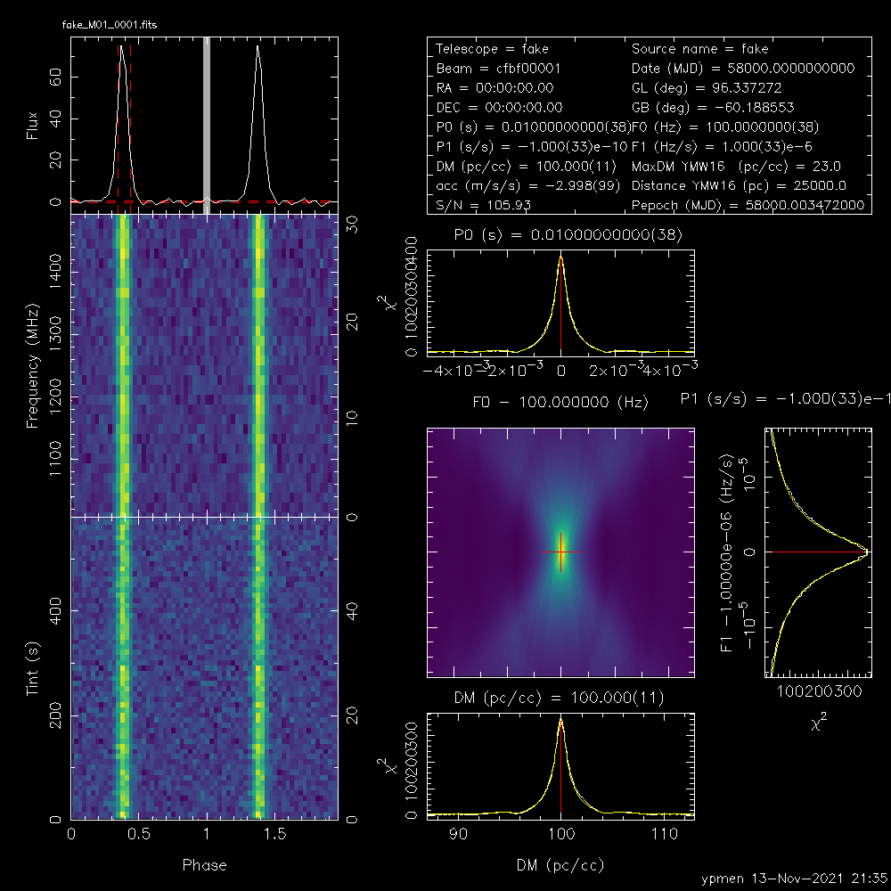

# PulsarX

PulsarX is a toolset for pulsar searching, including RFI mitigation, dedispersion, folding, optimization and accelerate search (under development). Psrfits and filterbank are both supported.

## Requirements:
- boost > 1.56
- PlotX (https://github.com/ypmen/PlotX)
- XLibs (https://github.com/ypmen/XLibs)
- To calculate GL and GB, sofa library (https://www.iausofa.org/2020_0721_C/sofa_c-20200721.tar.gz) should be installed.
- To calculate YMW16 DM and distance, environment variable YMW16_DIR should be set.

## Installation:
1) ./bootstrap
2) ./configure --prefix=/install\_path LDFLAGS="-L/path_to_sofa" CPPFLAGS="-I/path_to_sofa"
3) make and make install

## Programs

- ### filtool 
  clean the filterbank file or psrfits file (--psrfits), and generate a new one, e.g.\
  `filtool -v --filplan`[`filplan.json`](examples/filplan.json)`-f *.fil`
- ### dedisperse_all_fil
  remove rfi and dedisperse the filterbank/psrfits (--psrfits) file, e.g.\
  `dedisperse_all_fil -v --ddplan` [`ddplan.txt`](examples/ddplan.txt) `-z zdot --format presto -f *.fil`
- ### psrfold_fil
  fold and optimize the pulsar candidate, e.g.\
  `psrfold_fil -v --template ~/software/PulsarX/include/template/meerkat_fold.template --candfile` [`example.cands`](examples/example.cands) `--plotx -n 64 -b 64 --clfd 2 -f *.fil`
  

## Docker:
`docker pull ypmen/pulsarx`

## Citation
Please cite https://arxiv.org/abs/2309.02544, if you are using PulsarX.

## Acknowledgement
Thanks for very helpful suggestions and bug reports from Ewan Barr, Colin Clark, Emma Carli, Shalini Sengupta, Vivek Venkatraman Krishnan,  Miquel Colom i Bernadich, Prajwal Padmanabh, Alessandro Ridolfi, Vishnu Balakrishnan, Ralph Eatough, Fazal Kareem and TRAPUM project.
